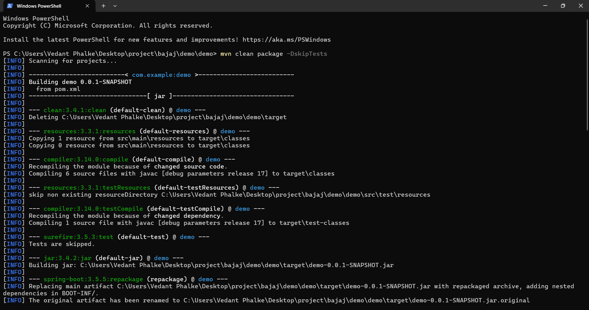
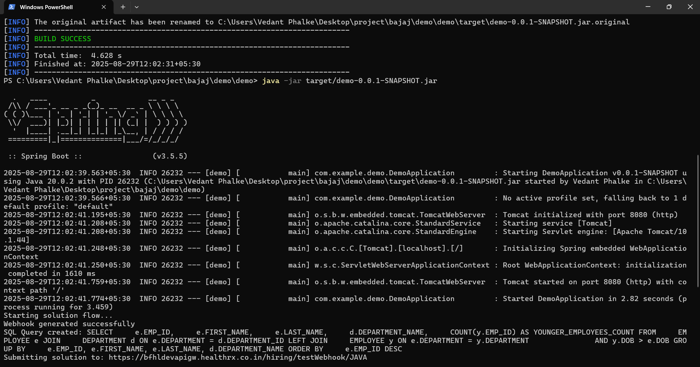
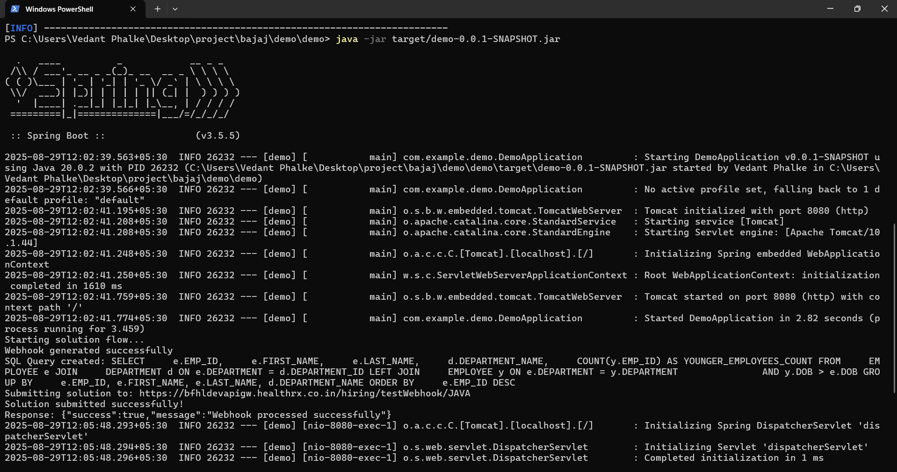

# Project Title

Here are some screenshots of the project:
Bajaj Spring Boot Webhook & SQL Solution App
📌 Overview

This project is a Spring Boot application built as part of the Bajaj Hiring Task.
The app demonstrates automation, API integration, and SQL problem-solving by following a predefined workflow:

On startup, the app generates a webhook URL via a POST request.

It then solves a SQL-based question assigned from a given problem set.

The final SQL query is securely submitted back to the webhook using a JWT token for authentication.

The process is fully automated – no manual controller endpoints are required to trigger the flow.

## 📦 Submission  

- **GitHub Repo:** [https://github.com/VedantPhalke1/bajaj](https://github.com/VedantPhalke1/bajaj)  
- **Download JAR:** [Click Here](https://github.com/VedantPhalke1/bajaj/raw/main/target/demo-0.0.1-SNAPSHOT.jar)

⚙️ Features
✅ Automatically generates webhook on application startup
✅ Dynamically fetches webhook URL and accessToken
✅ Builds and executes the SQL query based on registration number rules (Odd/Even → Question 1/2)
✅ Submits solution via REST API with JWT authorization
✅ Packaged as a runnable Spring Boot JAR

